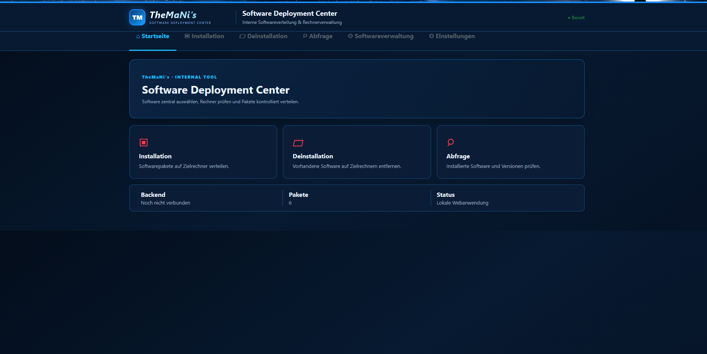
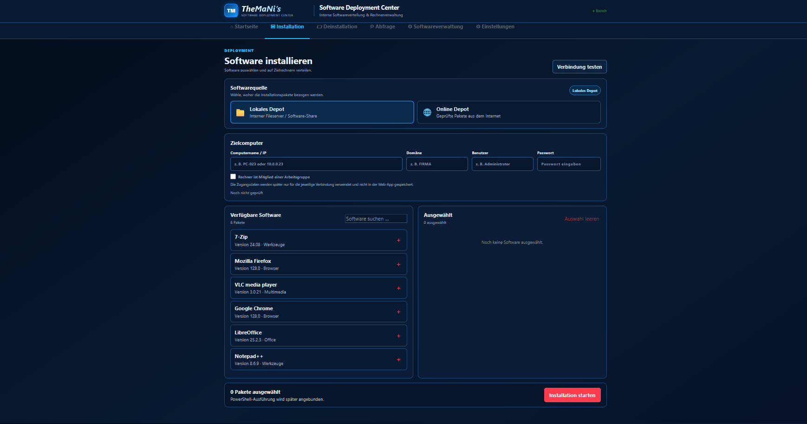
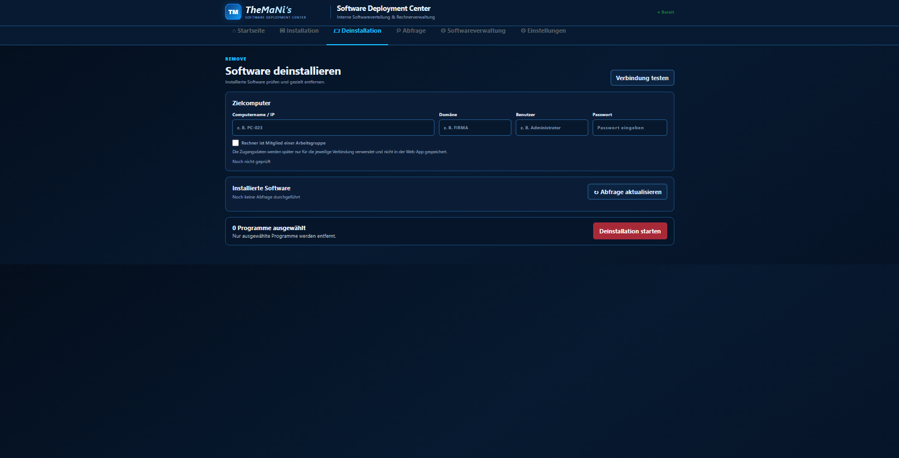
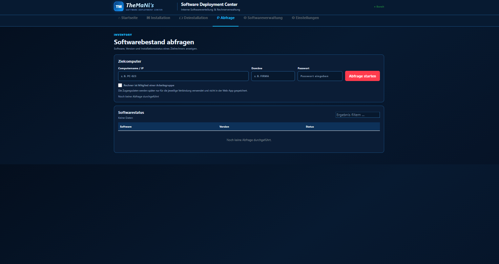
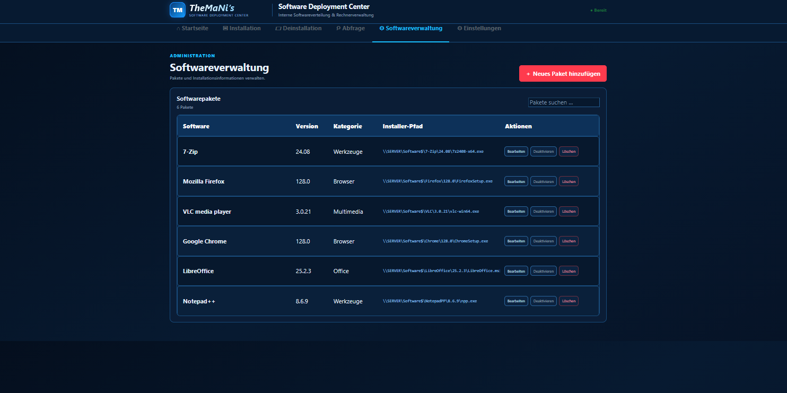
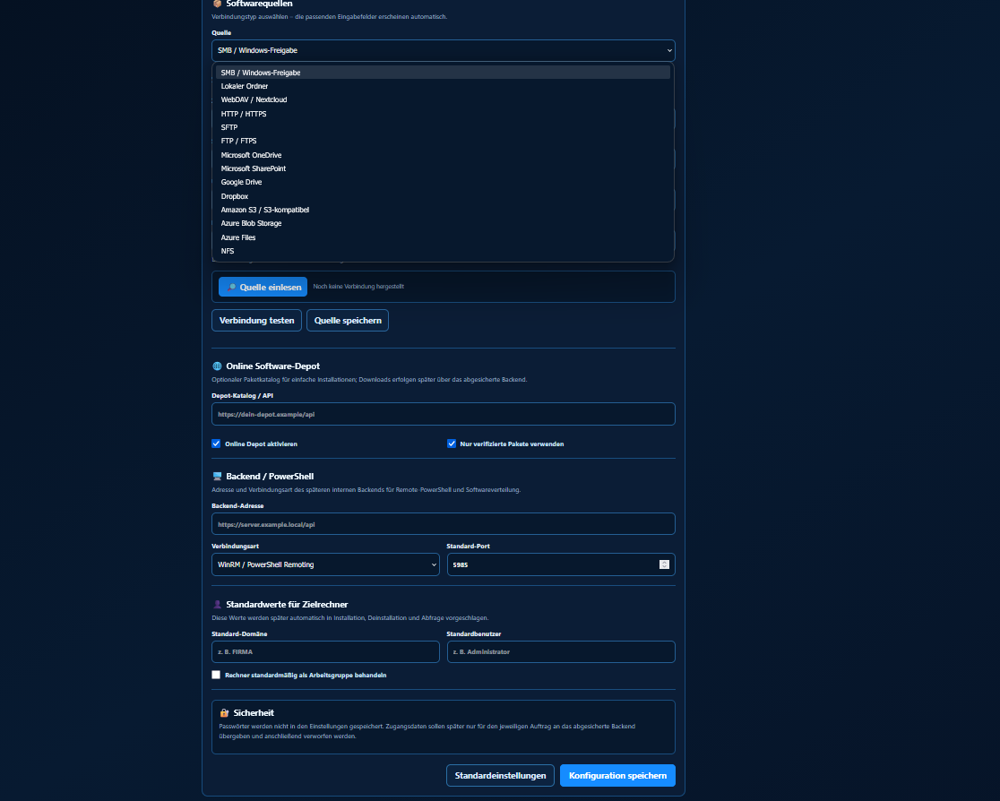

# TheMaNi Software Deployment Center

> 🚀 **Latest Release: v1.2.1**
>
> v1.2.1 introduces **Client Management** for organizing, monitoring and
> selecting target computers throughout the application, as well as
> **English language support** alongside the existing German interface.

A web-based Windows Software Deployment and Software Management Center
for managing, detecting and updating Windows software packages.

TheMaNi ist ein webbasiertes Software Deployment Center zur Verwaltung und Bereitstellung von Windows-Software.

Das Projekt befindet sich aktuell in aktiver Entwicklung und dient gleichzeitig als praktisches Projekt zur Erprobung einer KI-gestützten Softwareentwicklung.

Funktionen
Verwaltung von Softwarepaketen
Lokales Python-Backend
Webbasierte Benutzeroberfläche
Einbindung externer Softwarequellen
Google Drive als öffentliches Softwaredepot
Automatisches Einlesen von Installationspaketen
Erkennung von Software und Versionen
Übernahme und Aktualisierung von Paketen
Erkennung und Bereinigung von Paket-Dubletten
Speicherung und Wiederverwendung konfigurierte Softwarequellen
Aktuell unterstützte Installationsdateien
.MSI
.EXE
.MSIX
.MSIXBUNDLE
.APPX
.APPXBUNDLE
.CMD
.BAT
.PS1
Start

Voraussetzung ist Python 3.

Das Projekt wird über folgende Datei gestartet:

start-TheMaNi-LocalServer.cmd

Das Skript startet das lokale Backend sowie die Weboberfläche automatisch.

Projektstatus

🚧 In Entwicklung

Weitere Softwarequellen, automatisierte Downloads, Paketbereitstellung und zusätzliche Deployment-Funktionen befinden sich in Planung bzw. Entwicklung.

Ziel

TheMaNi soll eine möglichst einfache und flexible Softwareverteilung ermöglichen, bei der Software sowohl aus lokalen Quellen als auch aus externen Softwaredepots bereitgestellt werden kann.

KI-gestützte Entwicklung

Ein Teil der Entwicklung erfolgt mit Unterstützung generativer KI. Anforderungen, Funktionsumfang, Tests, Fehleranalyse und Validierung werden dabei eigenständig definiert und durchgeführt.

Hinweis

TheMaNi befindet sich noch in einer frühen Entwicklungsphase. Funktionen können sich ändern und sind möglicherweise noch nicht für den produktiven Einsatz geeignet.

## Screenshots

### Dashboard

### Software Verteilung

### Deinstallation

### Softwareabfrage

### Softwareverwaltung

 ### Client Management

### Softwarequellen

### Optionale Sprache

